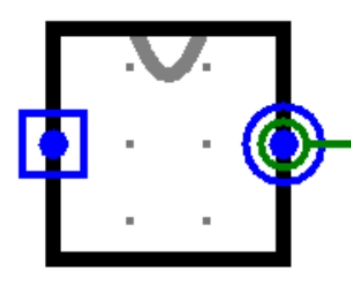

# x mod 5

> Moore型状态机，Logisim 时序逻辑
>
> 难度: 4
>
> 分值: 2

#### *实验任务*

很多数学问题都可以使用有限状态机解决。

这道题要求你搭建一个**Moore型状态机**解决求**x mod 5**的数学问题。

#### *实验具体要求*

使用Logisim搭建电路，该电路串行输入一个二进制无符号数X(先从高位输入,每输入一个数字就相当于之前输入的数左移一位再加上当前输入的数字，在无输入时X默认为0)，输出x模 5的余数的电路并提交。

#### *输入输出要求*

（1）输入： **In（1bit 串行输入）**

（2）输出：**RESULT（运算结果，3bit二进制数）**

（3）请将文件命名为：test3.circ，文件内模块命名为xmod5

（4）注意：请保证模块的apperance与下图完全一致，否则可能造成评测错误！(查看模块appearance方法:在Logisim中打开相应模块后点击

 左上角按钮）

