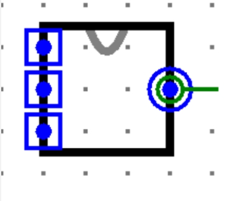

# LAB1 小型ALU

> Logisim 组合逻辑
>
> 难度: 2
>
> 分值: 4

请在开始写这个作业之前，参照手册或视频，自行学习Plexers等Logisim元件的使用。

说明：Plexers等元件的使用可以参考Logisim中文指导手册

#### *实验任务*

算术逻辑单元(arithmetic and logic unit) 是能实现多组算术运算和逻辑运算的组合逻辑电路，简称ALU，是中央处理器（CPU）的重要组成部分。简单来讲，就是CPU中负责进行计算（算数和逻辑运算）的电路元件。

这道题要求你自己动手搭建一个小型ALU。

#### *实验具体要求*

要做ALU，首先我们要了解ALU的输入输出端口。ALU本身是一个纯组合逻辑电路，它需要我们传入要进行计算的数据，并且“告诉”它对于这两个数据，要进行何种运算，之后它就会输出结果。

那么如何通知ALU要进行何种运算呢？我们把它抽象成一个数字输入信号，例如在本题中，我们采用一个四位二进制数输入信号作为ALU的控制信号（ALUOp），具体对应关系如下：

| ALUOp | 对应的运算                              |
| ----- | --------------------------------------- |
| 0000  | i1 << i2                                |
| 0001  | i1 >>> i2 （算术右移）                  |
| 0010  | i1 >> i2 （逻辑右移）                   |
| 0011  | i1 * i2（无符号乘法，仅保留低32位结果） |
| 0100  | i1 / i2 （无符号除法，仅保留32位商）    |
| 0101  | i1 + i2                                 |
| 0110  | i1 - i2                                 |
| 0111  | i1 & i2                                 |
| 1000  | i1 \| i2                                |
| 1001  | i1 ⊕ i2                                 |
| 1010  | I1 NOR I2                               |
| 1011  | R = (X < Y) ? 1 : 0（有符号比较）       |
| 1100  | R = (X < Y) ? 1 : 0（无符号比较）       |

**注意：**

（1）**不要自己手搓加法器和减法器！logisim库里有现成的，直接使用logisim自带的加法器减法器就可以。手搓可能会导致评测TLE!**

（2）**进行移位运算时，32位二进制数i2表示移多少位，其高27位应该被舍弃，仅低5位有效。**

#### *输入输出要求*

（1）输入：**i1（第一个运算数，32bit），i2（第二个运算数，32bit），ALUOp（ALU控制信号，4bit）**

（2）输出：**R（运算结果，32bit）**

（3）请将文件命名为test2.circ，文件内模块命名为ALU

（4）**注意：请保证模块的apperance与下图完全一致，否则可能造成评测错误！**(查看模块appearance方法:在Logisim中打开相应模块后点击左上角按钮)

（输入端从上到下依次是i1,i2,ALUOp）
