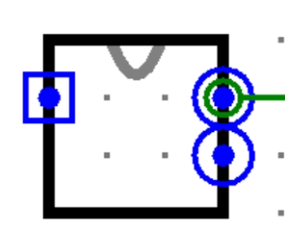

# 自动售货机

> Logisim 时序逻辑
>
> 难度: 2
>
> 分值: 4

### **实验任务**

使用logisim搭建一个模拟自动售货机工作的有限状态机。

### **实验具体要求**

现有一种自动售货机，它只售卖一种商品，售价5元。消费者持有1元、2元、4元的硬币别问我两元和四元硬币是啥，不要在意那些细节。消费者可以分多次投入硬币（消费者每个时钟周期都会投入**一枚**硬币，不存在不投币或者一次投入多枚硬币的情况），当机器检测到金额足够的时候就吐出商品并且找零，请使用**Mealy型有限状态机**完成这一电路。

提示：大家不要想复杂，SOLD和CHARGE严格遵守Mealy有限状态机的规定：即这两个输出信号仅与当前售货机状态和当前输入信号INPUT有关，售货机的状态仅在时钟上升沿发生变化。

### **输入输出要求**

（1）输入：**INPUT（每次投入的硬币面额，二进制形式输入，3bit）**

（2）输出：**SOLD（表示是否吐出商品，是输出1，否输出0，1bit），CHARGE（找零，2bit）**

（3）请将文件命名为exam3.circ，主模块命名为sold。

（4）**注意：请保证模块的apperance与下图完全一致，否则可能造成评测错误！**(查看模块appearance方法:在Logisim中打开相应模块后点击

 左上角按钮)

 

 *Figure* *3:*

 （右侧输出部分从上到下依次是SOLD,CHARGE）