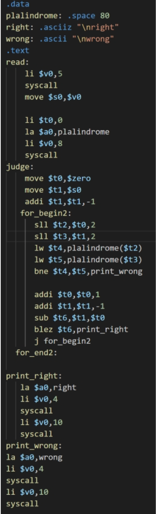

# 回文串判断

> 分值：4
>
> 难度：1

## 实验任务

1. 判断输入的字符串是不是回文串.

2.  如果是回文串则输出right，否则输出wrong.

下面是有错误的代码：

当输入 `4` 以及 `abba` 的时候，程序正确输出了accept，在提交评测时，却是WA声一片。上面的代码中有多处问题，请把错误找出并修改。

## 提交要求

1.  请勿使用.globl main。

2. 不考虑延迟槽。

3. 只需要提交.asm文件。

4. 程序的初始地址设置（Mars->Settings->Memory Configuration）为Compact,Data at Address 0。

 